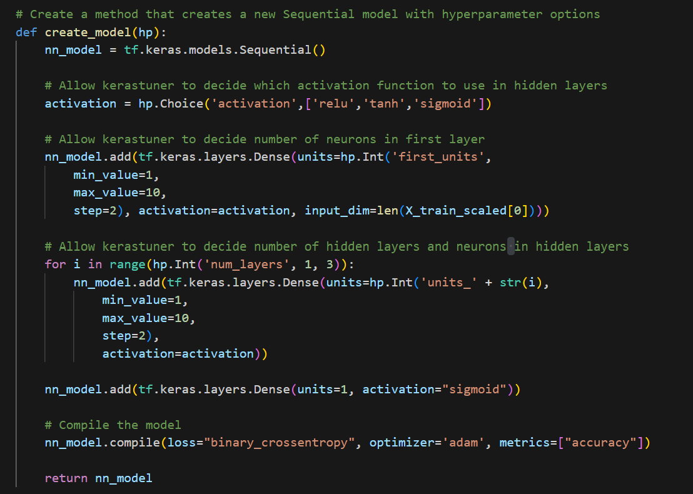
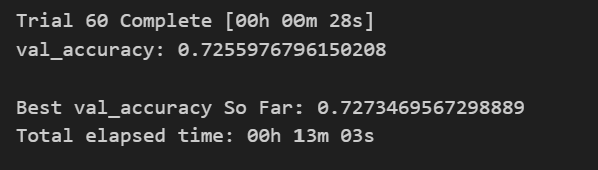
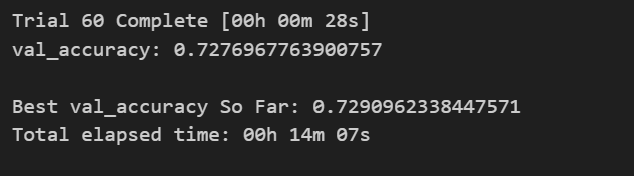
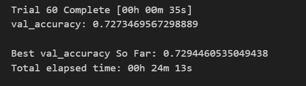
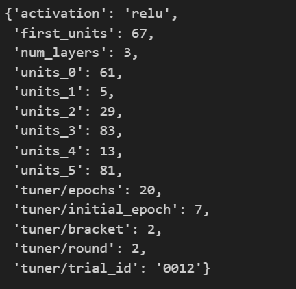

# deep-learning-challenge
This repository contains the starter code with the original model, the starter code with 3 attempts to optimize the model, a README file with the analysis report, the images included in the report, and the model h5 files. Most of the code was based in the exercises completed in class, but I also review code wit copilot and check some recommendations online.

# Overview 

Alphabet Soup is a nonprofit foundation that requested us to develop a tool that can help them select the applicants for funding with the best chance of success in their ventures.

To do so, the foundation's business team provided us with a CSV containing more than 34,000 organizations that have received funding from Alphabet Soup over the years, that includes the following information for each organization:
- EIN and NAME—Identification columns
- APPLICATION_TYPE—Alphabet Soup application type
- AFFILIATION—Affiliated sector of industry
- CLASSIFICATION—Government organization classification
- USE_CASE—Use case for funding
- ORGANIZATION—Organization type
- STATUS—Active status
- INCOME_AMT—Income classification
- SPECIAL_CONSIDERATIONS—Special considerations for application
- ASK_AMT—Funding amount requested
- IS_SUCCESSFUL—Was the money used effectively

Therefore, we developed different models to predict whether applicants will be successful if funded by Alphabet Soup. It is important to highligh that, after developping the first model, we applied different methods to optimize with the goal of achieve a model with better accuracy.

# Results

# - Data Preprocessing:
- The target variable of the model is the "Is Successful" (1 of the organization used the funding effectively and 0 if the organization didn't used the funding effectively).
- The feature variables of the model are:
        - APPLICATION_TYPE
        - AFFILIATION
        - CLASSIFICATION
        - USE_CASE
        - ORGANIZATION
        - STATUS
        - INCOME_AMT
        - SPECIAL_CONSIDERATIONS
        - ASK_AMT
- The variables that were removed from the input data because they are neither targets nor features are EIN and NAME.

# - Compiling, Training, and Evaluating the Model:

Original Model:

The original model has 3 layers:
- Input Layer: 8 units and Relu activation.
- Hidden Layer: 5 units and Relu activation.
- Output Layer: 1 unit and Sigmoid activation.

The result of the model shows the following:

An accuracy of 72.51% and a loss of 0.556%.

Model Optimization:

To optimize the original model I used the keras_tuner library and applied a function that allows keras_tuner to decide which activation function to use in each hidden layer and the optiomal number of units.

Although I never reached the target model accuracy of 75%, I did 3 model optimization attempts and, by changing number of layers and the maximum units, I was able to achieve a higher accuracy in each attempt.
As observed, increasing the number of layers and the number of maximum units are 2 of the possible ways of achieving a better model, that has a better accuracy.

For the first model attempt, I tested a model with 3 layers with up to 10 units, and I reached an accuracy of 72.73%.

For the second model attempt, I tested a model with 5 layers with up to 50 units, and I reached an accuracy of 72.91%.

For the third and last model attempt, I tested a model with 6 layers with up to 100 units, and I reached an accuracy of 72.94%.

The third and last model optimization attempt was the best model, and has the following characteristics:

# Summary

As explained before, by using the keras_tuner library and changing the number of layers and units for each layer I was able to reach better models, the best one with accuracy of 72.94% and loss of 54.94%. However, all of them with accuracy figures under 75% which was the requested target for the exercise. One of the things that could have contributed to achieve a model with higher accuracy is the amount of input data. By increasing the amount of input data probably the model will be more accurate.

As an alternative to the neural network model, for solving classification tasks we could also use a random forest model which is more simple than the one used in this exercise. In general, random forest models are more robust and provide excelent accuracy levels. In addition, they are resistant to overfitting and are more interpretable. Finally, random forest models require less data and with less preparation, which could be better to solve this exercise given that we didn't have a big dataset.

