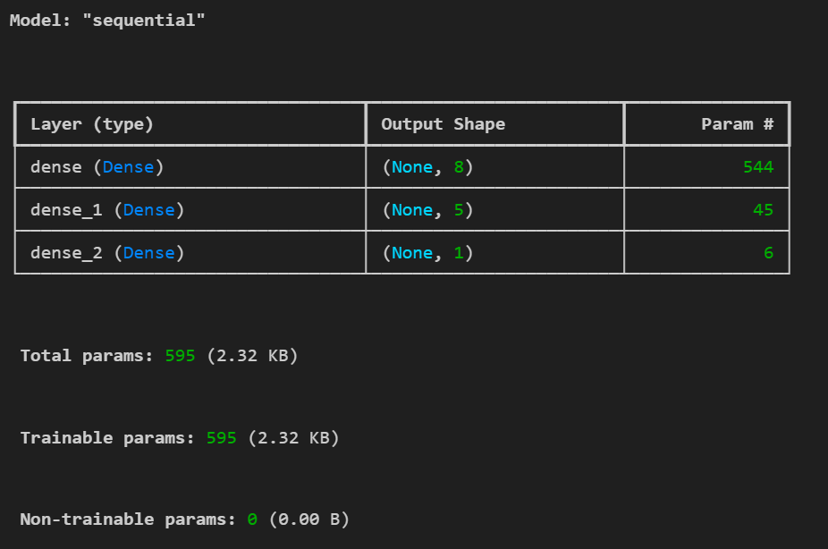
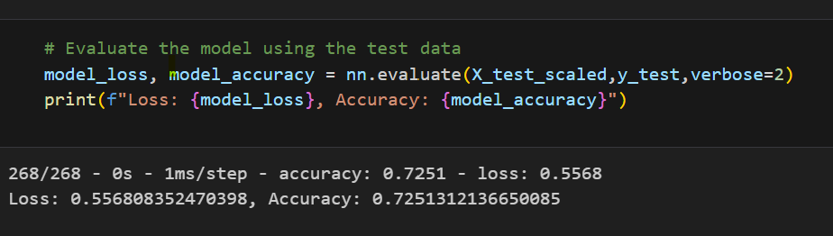

# deep-learning-challenge

# Overview 

Alphabet Soup is a nonprofit foundation that requested us to develop a tool that can help them select the applicants for funding with the best chance of success in their ventures.

To do so, the foundation's business team provided us with a CSV containing more than 34,000 organizations that have received funding from Alphabet Soup over the years, that includes the following information for each organization:
- EIN and NAME—Identification columns
- APPLICATION_TYPE—Alphabet Soup application type
- AFFILIATION—Affiliated sector of industry
- CLASSIFICATION—Government organization classification
- USE_CASE—Use case for funding
- ORGANIZATION—Organization type
- STATUS—Active status
- INCOME_AMT—Income classification
- SPECIAL_CONSIDERATIONS—Special considerations for application
- ASK_AMT—Funding amount requested
- IS_SUCCESSFUL—Was the money used effectively

Therefore, we developed different models to predict whether applicants will be successful if funded by Alphabet Soup. It is important to highligh that, after developping the first model, we applied different methods to optimize with the goal of achieve a model with better accuracy.

# Results

# - Data Preprocessing:
- The target variable of the model is the "Is Successful" (1 of the organization used the funding effectively and 0 if the organization didn't used the funding effectively).
- The feature variables of the model are:
        - APPLICATION_TYPE
        - AFFILIATION
        - CLASSIFICATION
        - USE_CASE
        - ORGANIZATION
        - STATUS
        - INCOME_AMT
        - SPECIAL_CONSIDERATIONS
        - ASK_AMT
- The variables that were removed from the input data because they are neither targets nor features are EIN and NAME.

# - Compiling, Training, and Evaluating the Model:

Original Model:

The original model has 3 layers:
- Input Layer: 8 units and Relu activation.
- Hidden Layer: 5 units and Relu activation.
- Output Layer: 1 unit and Sigmoid activation.

The result of the model shows the following:

An accuracy of 72.51% and a loss of 0.556%.

Model Optimization:

